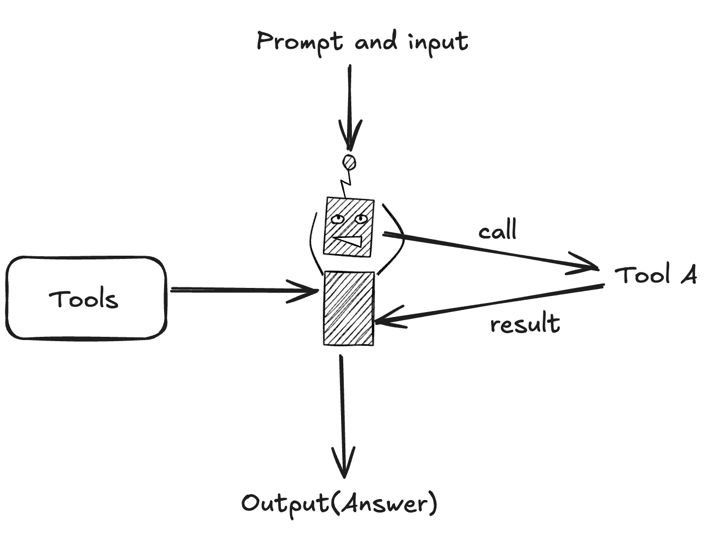
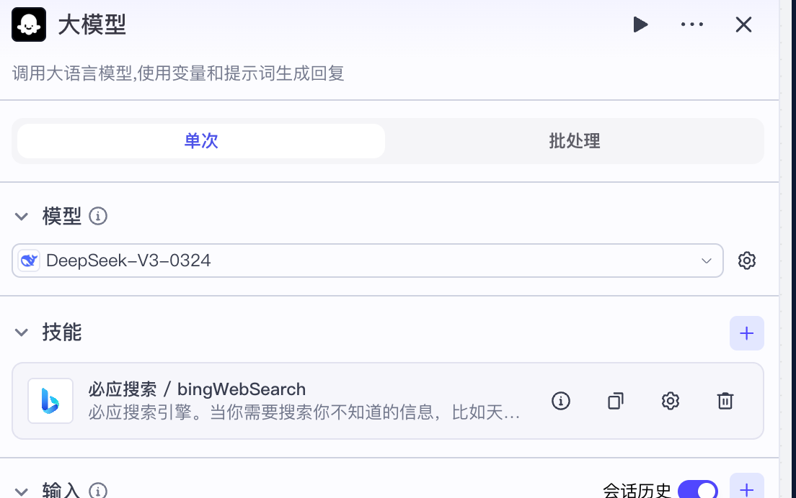

# 一起学LLM Agent - 壹

## 0x01 前言

最近大模型结合Agent（智能体）的话题都挺火的，刚好我对这块也挺感兴趣的，工作上和平时私底下也都有接触到，所以就想着能一边学习一边记录然后分享一下自己的想法以及思考。

想要学的第一步，应该是明白什么是LLM Agent，能够用一句话概括。

## 0x02 什么是LLM Agent

把LLM Agent翻译成中文，LLM显而易见就是大语言模型（Large Language Model）。

Agent的话就稍微有一点歧义，我同事喜欢叫做`代理`​，那我个人更喜欢叫做`智能体`​，更符合他的能力和用途，相比较于大模型，Agent能够主动做出动作，然后分析问题解决问题。

> The [OpenAI Agents SDK](https://github.com/openai/openai-agents-python) enables you to build agentic AI apps in a lightweight, easy-to-use package with very few abstractions. It's a production-ready upgrade of our previous experimentation for agents, [Swarm](https://github.com/openai/swarm/tree/main). The Agents SDK has a very small set of primitives:
>
> * **Agents**<span data-type="text" style="background-color: var(--b3-card-success-background); color: var(--b3-card-success-color);">, which are LLMs equipped with instructions and tools</span>
> * **Handoffs**, which allow agents to delegate to other agents for specific tasks
> * **Guardrails**, which enable the inputs to agents to be validated

这是OpenAI Agents SDK对于Agent的定义：<u>即配备有指令和工具的大型语言模型 (LLM)</u>

我个人认为这样的解释太过于片面了，或者说，看完这样的解释，还是对Agent有一个很好对理解。

我之前有接触并稍微学习过DQN（深度强化学习），它其中也有一个Agent智能体，对于强化学习中的Agent，就是能根据当前的环境（可能包含时间序列上下文的环境）并做出动作行为的智能个体。

那映射到大模型的智能体就很好理解了，把提示词、目标、消息上下文、可用的工具等输入给大模型的，就是环境，他的输出调用Tool/Function（工具）就是动作行为。

所以总的来说，LLM Agent一句话概括：**能够根据需求，合理的调用正确外部工具的大语言模型**

​

## 0x03 什么是工具（Tool/Function）

在上面为了简单理解什么是LLM Agent的时候，有一直在说到**工具**，那这个工具到底是个什么东西？

都说人和动物的区别，就是人会使用工具。这个道理作用到大模型也是同样适用，能调用工具的大模型和不能调用工具的大模型的能力简直是天差地别。

“工具”这个叫法我觉得并不能真正的理解它的底层的含义，我认为它应该称为是一种媒介或者是规则和协议，来定义大模型与外部世界的交互方式。

举一个简单🌰来更清楚的说明它的原理

* 将工具当做是一个个间谍
* 大模型是一个指挥官
* 间谍们和指挥官约定了在一个地方藏了一张纸条，指挥官会在纸条上面写哪些间谍要做什么内容是什么，对应的间谍看到后，间谍会把执行任务然后把结果和拿到的信息重新写回到纸上告诉指挥官

那其实所谓的工具也是这样，无非就是使用提示词和大模型第一好了一套输出规则，比如使用JSON，拿到大模型的输出后，进行解析，然后得到要调用什么工具的信息，然后再把调用了工具的到的内容再告诉大模型

最近和Agent一起火的MCP协议就很好说明了，他就是为大模型定义了调用各种外部工具的一种协议。

## 0x04 Hello World!

说了这么多，为何不直接上手试试创建一个自己的Agent。

这里可以使用Coze，可以通过简单的图形化界面，就可以配置出一个能够规划、搜索、整理旅游信息的Agent。

<video controls="controls" src="assets/simple-agent-coze.mp4" data-src="assets/simple-agent-coze.mp4"></video>

效果看起来还是可以的，要创建一个这样的Agent也是相当简单，只需要一段提示词，再设置一个联网搜索的工具即可。

```markdown
## 设置

您是一个好奇的喜欢探索并热爱思考的智能体，可以根据用户的需求，分析并思考，然后在网上搜索，完成旅游行程规划


## 规则

1. 任务拆解，需要将用户的行程需求进行问题拆分
  - 例如：目的地天气、交通方式、目的地景区、目的地美食等
2. 完成任务拆分后，依次进行搜索，以获取足够的信息
3. 在搜索的同时，你需要将你的思路告诉用户
4. 当信息足够完整时，需要生成一份详细的行程报告
```

​

## 0x05 结语

壹 中只是将LLM Agent从非常宏观的角度去理解了什么是Agent，但为了真正去了解它是什么，接下来会使用代码，从0手搓一个Agent。

see ya～

‍
